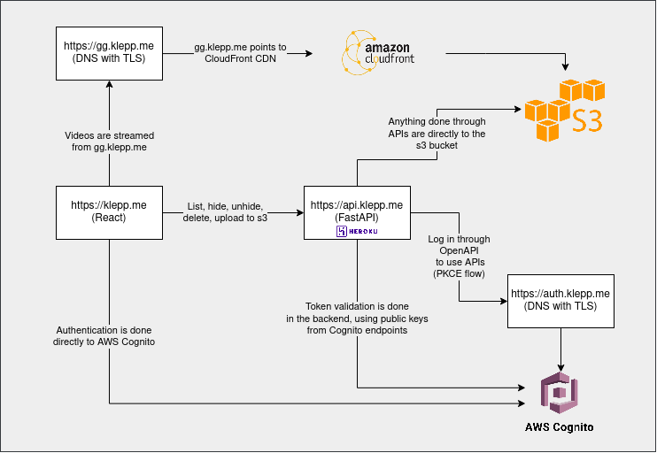
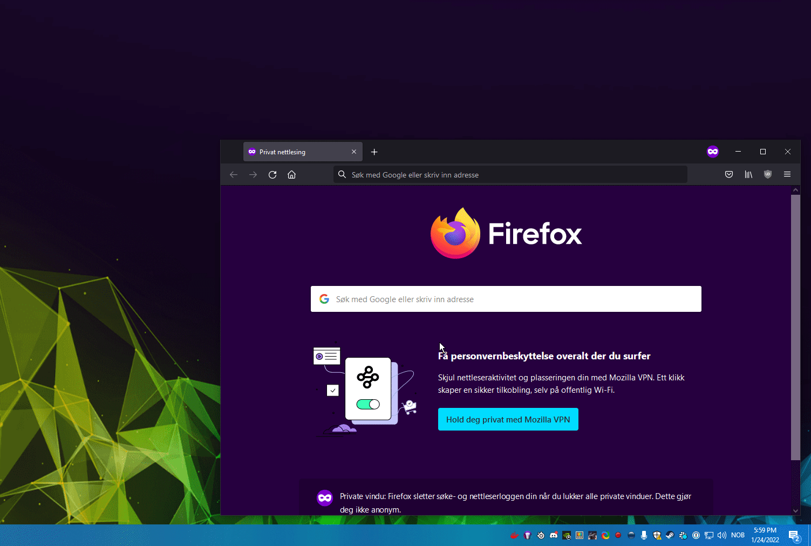

# klepp.me
*A service to share clips among friends, while owning and managing our own data*  

### Stack

**Storage**: [gg.klepp.me](https://gg.klepp.me) -> TLS through AWS Certificate Manager -> AWS Cloudfront CDN -> AWS S3 bucket    
**API**: [api.klepp.me](https://api.klepp.me/docs) -> TLS through Heroku -> Hosted on Heroku -> FastAPI -> [validate tokens](app/api/security.py) -> [S3 bucket](app/api/api_v1/endpoints/file.py)    
**Authentication** [auth.klepp.me](https://auth.klepp.me) -> TLS through AWS Certificate Manager -> AWS Cognito -> Validating tokens in backend  
**Frontend**: [klepp.me -  Soon™](https://klepp.me) - x -> TLS -> React frontend -> Cognito auth -> Requests to the API

Visualized something like this:  

## What?
[klepp.me](https://klepp.me) tries to be a [streamable.com](https://streamable.com/) / [pomf.cat](https://pomf.cat/) clone, 
which integrates natively with [`ShareX`](https://getsharex.com/). 
Any screenshot or video recorded through this program is automatically be uploaded to `gg.klepp.me`. When the file has been
uploaded, a URL with a link to the resource is automatically stored in your clipboard.  
This file can be shared with friends and viewed directly in your browser. There is no size limit on any file.

The API allows the user to list all video files from all users. If a user don't want a video to be listed, the user can hide their own video from this list.
The user can at any point unhide/show the video again to allow others to discover it. All users can upload and delete their own files, even those
uploaded through ShareX. 

The frontend allow you to list and view the latest clips, as well as managing your own files as described above.

TL;DR:   
**ShareX support**: Upload clips, files and images directly to the s3 bucket. Share `gg.klepp.me`-links directly.  
**API**: Upload, delete and manage your own files. List all files that are not in a hidden folder. Hide files you don't want to be listed from the list-API.  
**Frontend**: View clips from all users, sorted on newest  

The gif is below is an example on how to snippet a screenshot with ShareX, which automatically gets uploaded to the s3 bucket and returns a `gg.klepp.me` URL. The same workflow
works for GIF and videos too.

## Why?

I started using `pomf.cat`, until I automatically uploaded a screenshot of my desktop with personal information in it. 
Since `pomf.cat` has no users, there was no way for me to delete this screenshot without mailing the owners of the site hoping they would listen (they did!). 
At this point, I knew I could never use pomf.cat or untrusted service for this purpose again.  
For videos, I used to `streamable.com`. The size limit is better, but 13 dollar per month (per user) for permanent
storage of short clips seemed a bit steep. 

My friends and I share these clips among us. Sometimes we sit on teamspeak, drink beer and watch back old clips. With the new frontend
and history of all our uploads, we can do this without looking through browser history and re-uploading.

TL;DR: Trust issues to external sites, price, permanent storage, frontend with our clips only. 

## But klepp..?
Yes, we tend to yell "CLIP!" or "KLEPP!" whenever someone does something we think should be clipped (ShadowPlay) and shared after a game :)

## Cool!
Keep in mind this all of this was done in a few days, without any thought of beautiful code or tests. 
It is probably secure, but I wouldn't bet on it. 
