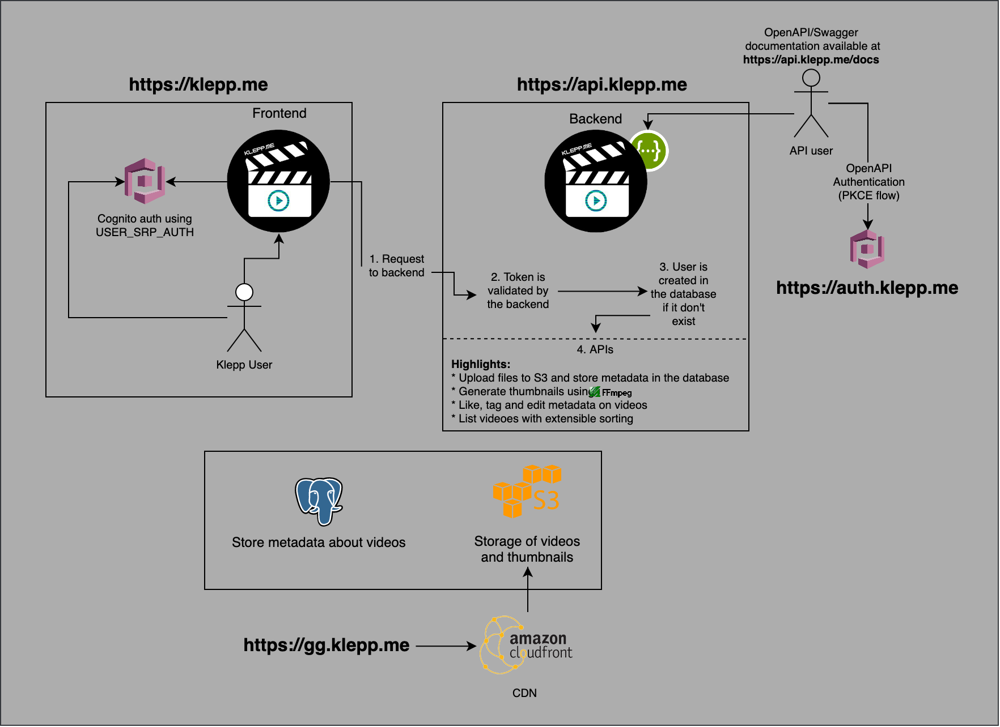

# klepp.me
*A service to share clips among friends, while owning and managing our own data*  

**NB:** v2 rewrite in progress.

### What?

[klepp.me](https://klepp.me) version 1 started off to be a [streamable.com](https://streamable.com/) / [pomf.cat](https://pomf.cat/) clone, 
which integrated natively with [`ShareX`](https://getsharex.com/). 
Any screenshot or video recorded through this program is automatically be uploaded to `gg.klepp.me`. When the file has been
uploaded, a URL with a link to the resource is automatically stored in your clipboard.  

The v1 APIs of `klepp` only used S3 APIs to list and manage files. Due to object storage having very limited
functionality, we outgrew its functionality within hours. The need for a better list-API with pagination and 
extensible sorting on users, tags, likes etc. was immediate. The frontend also had performance issues
due to loading too many videos, so automatic generation and storage of video thumbnails became a necessity.

  
V1 and V2 feature comparison table

|                      | **v1** | **v2**  |
|----------------------|--------|---------|
| Cognito login        | ✅      | ✅️      |
| List Videos          | ✅      | ✅️      |
| Sorting              | ❌      | ✅️      |
| Pagination           | ❌      | ✅️      |
| ShareX support       | ✅      | ✅️*     |
| Upload Videos        | ✅      | ✅️      |
| Delete Videos        | ✅      | ✅️      |
| Hide videos          | ✅      | ✅️      |
| Like videos          | ❌      | ✅️      |
| Tags                 | ❌      | ✅️      |
| Thumbnail generation | ❌      | ✅️      |

*\* ShareX support still there, but these videos will not show up in the list API, since a DB is used instead
of reflecting the S3 bucket. We might add a lambda to create the entry uploaded from ShareX in the database,
but this a low priority now that we have a GUI.*

### Stack

* **Storage**: [gg.klepp.me](https://gg.klepp.me) -> AWS Cloudfront CDN -> AWS S3 bucket    
* **API**: [api.klepp.me](https://api.klepp.me/docs) -> Hosted on Heroku -> FastAPI -> [validate tokens/Cognito auth](app/api/security.py) -> API View  
  * **Database**: PostgreSQL using SQLModel/SQLAlchemy 
* **Authentication** [auth.klepp.me](https://auth.klepp.me) -> AWS Cognito
* **Frontend**: [klepp.me](https://klepp.me) -> GitHub pages -> React frontend -> Cognito auth -> Requests to the API

TLS is achieved on all sites using either AWS Certificate Manager, Heroku or GitHub pages. 

Visualized something like this:  

  
You can see the v1 visualization here

  

  
ShareX support visualized:

  

## Why?

I started using `pomf.cat` until I automatically uploaded a screenshot of my desktop with personal information in it through ShareX. 
Since `pomf.cat` has no users, there was no way for me to delete this screenshot without mailing the owners of the site hoping they would listen (they did!). 
At this point, I knew I could never use pomf.cat or an untrusted service for this purpose again.  
For videos, I used `streamable.com`. The size limit is better, but 13 dollar per month (per user!) for 
a simple, permanent storage of video clips is *steep*. 

TL;DR: Trust issues to external sites, price, permanent storage, frontend with our clips only. 

|                                                        | **Klepp** | **Streamable** | **Pomf.cat** |
|--------------------------------------------------------|-----------|----------------|--------------|
| Frontend to browse friends videos (community feel) | ✅         | ❌              | ❌            |
| Browse your own previous videos                        | ✅         | ✅              | ❌            |
| Permanent storage                                      | ✅ (Cheap) | ✅ (Expensive)  | ❌            |
| Own our own data                                       | ✅         | ❌              | ❌            | 

## But klepp..?
Yes, we tend to yell "CLIP!" or "KLEPP!" whenever someone does something we think should be clipped (ShadowPlay) and shared after a game :)

## Cool!
~~Keep in mind this all of this was done in a few days, without any thought of beautiful code or tests.~~ 
This project has evolved and been rewritten to use databases, generate thumbnails, have likes, tags etc.
However, this project is more about learning together with friends, hacking solutions and make things work than writing 
beautiful and well tested enterprise code. 

The authentication and token validation is inspired by [FastAPI-Azure-Auth](https://github.com/Intility/fastapi-azure-auth), 
a python package written by me. If you'd like to use Cognito authentication in your FastAPI app, I suggest you
look at that package instead of this repository, as I have not ported any tests over to this app. 
This API is probably secure, but I wouldn't bet in it. When it comes to security, you either test it or don't trust it, simple as that.

## The future
A lot of improvements can be done, but here's a few that I've been thinking about:

* Generate thumbnails using lambda instead of using the API container
* Pre-sign URLs and upload directly to S3 instead of through the S3 bucket
  * Use lambda to generate metadata in the database (using the Klepp-API)
* Infrastructure as Code 
* Multi-tenancy/groups to allow multiple communities